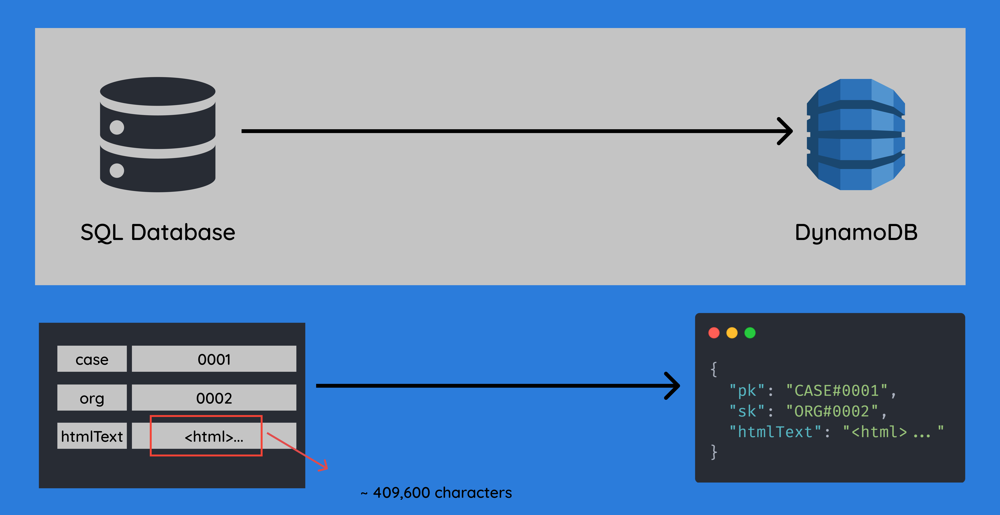
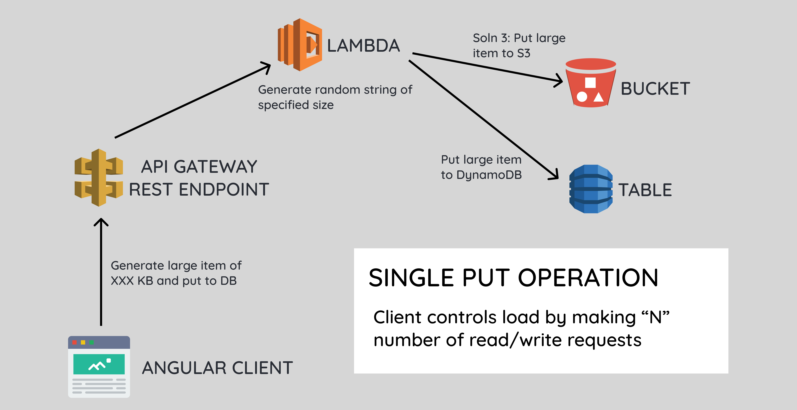
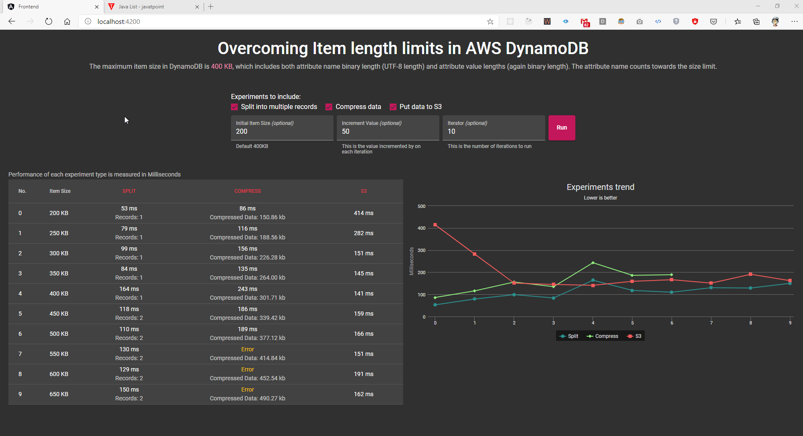
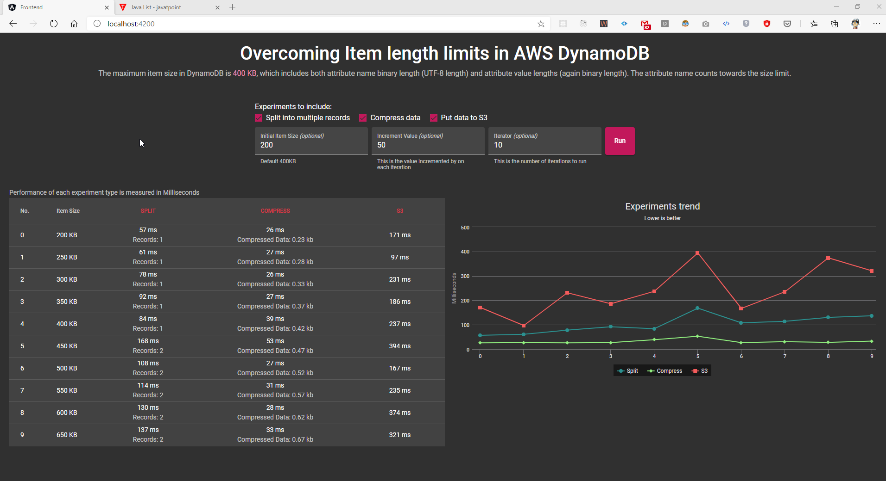
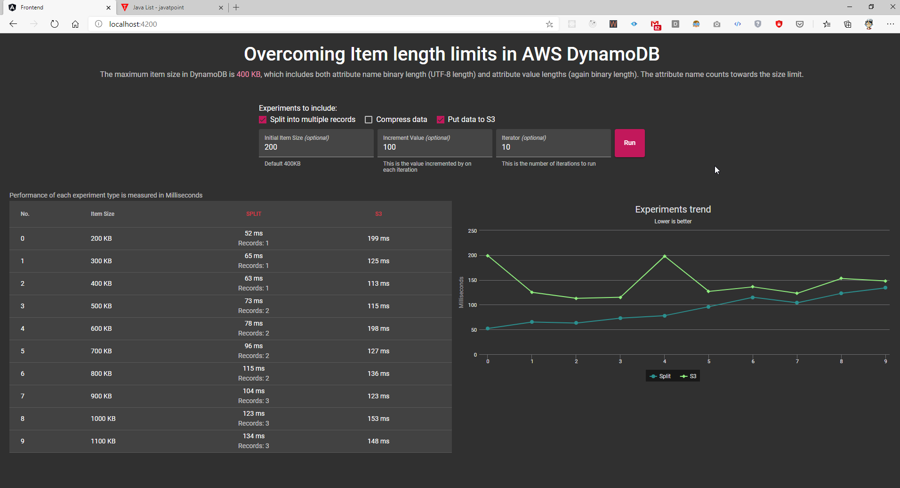
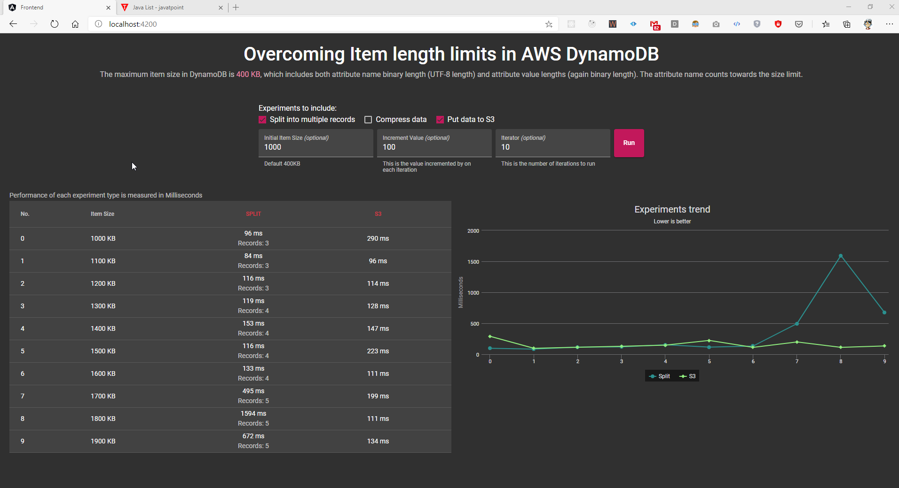
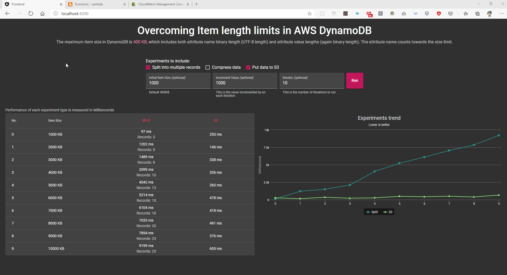
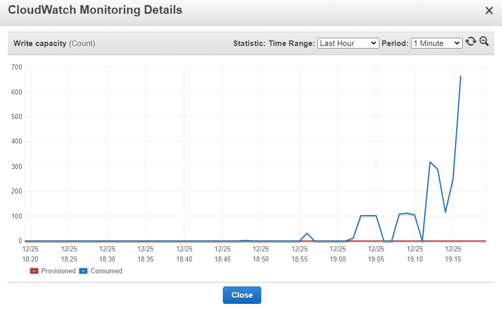
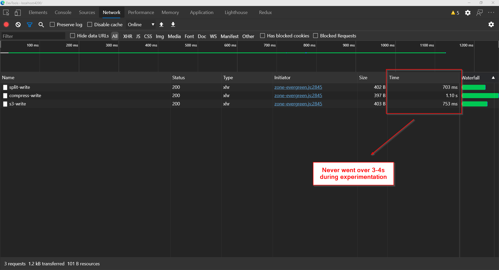
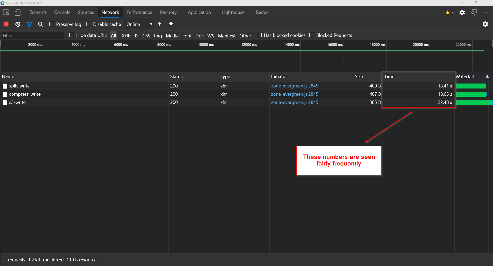

# Overcoming Item length limits in DynamoDB

## Authors:

- Adrian Diaconu
- Ashwanth A R

## Demo:

[Link to Demo](https://drive.google.com/file/d/1FLVj_JYubGmAUXGV7JwRYikPdhAL9ILT/view)

## Problem Statement:

When migrating data from an existing database to DynamoDB or creating a new database in DynamoDB, you can encounter items with large amounts of data. However, DynamoDB has a hard service limit with a maximum item size of 400 KB, which includes both attribute name binary length (UTF-8 length) and attribute value lengths (again binary length).

You can see the service limit in docs [here](https://docs.aws.amazon.com/amazondynamodb/latest/developerguide/Limits.html#limits-items).

Since each character in “String” data is represented in a byte (slightly different for “Binary” data), 400 KB means we will hit this limit with 409,600 characters. Given that this is not a lot, especially for certain kinds of data, this would be a problem that several projects could potentially run into. So, we determined that this is a high-impact problem worth solving and identifying the best solution for any given scenario.

## Options Considered:

There are 3 solutions that we are considering - Split, Compression and S3 Storage:

1. Split and Compose Approach - Split large items into multiple records with the same partition key and use sort key or gsi to track the order of the records.
2. Compression Approach - Compress large attribute values to fit them within the item limits in DynamoDB using compression algorithms such as GZIP or LZO
3. S3 Storage Approach - Use Amazon S3 to store large attribute values and then store the object identifier (or access url) in DynamoDB

Two approaches are discussed in more detail in docs [here](https://docs.aws.amazon.com/amazondynamodb/latest/developerguide/bp-use-s3-too.html).

## Solution:

### Important Technical Decision

**Based on our findings below, we recommend that for scenarios where there is large data involved, especially if it is larger than 600 KB, S3 storage is the recommended solution.**

If you have a specific case, where you know that 90%+ of your data points will never exceed 400 KB and the remainder will only exceed to 500-600 KB, “Split approach” could be an option to consider based on a good understanding of what the WCU and RCU consumption look like. 

If you have frequently repetitive and highly predictable patterns with good compression rates, you could consider the Compression approach.

### Goal:

Our goal in this experiment is to implement all the listed solutions and measure & compare the performance between these approaches. 

### Setup:

This repository contains the code to set up the below CloudFormation stack, along with an Angular frontend client. 
You can use the application to run the experiment for various data points to understand the performance of the three approaches.

The Angular application will control the size of the item by making a HTTP request to the API Gateway REST API endpoint with the item size as a paramenter.
The endpoint will invoke the appropriate lambda with this number. The lambda then generates a large text value so that the total item size meets the required item size as specified by the Angular application.
Once the item is generated, the lambda will start the performance measurement and make a putItem call to DynamoDB table or puts the item in S3 before passing item access url to DynamoDB based on our solution.
By measuring only the putItem operation in the lambda, we exclude any effects from network latency or item generation time. 

### Deployment Notes:

Set AWS credentials for your default AWS profile by running "aws configure" and set your `AWS_ACCESS_KEY_ID` and `AWS_SECRET_ACCESS_KEY`.

Ensure that you have:
- Java 11 https://docs.aws.amazon.com/corretto/latest/corretto-11-ug/downloads-list.html
- Gradle 6
- Node 12 (for frontend angular client)

Deploy the CloudFormation stack with command: `./gradlew run --args='ash'` where,
- 'ash' should be replaced by your 'env name'

Note that the CloudFormation stack is deployed to your default AWS profile.

### Key Insights:

For each experiment we took 3 observations to identify the general trend and discard any data point anamoly.

#### #1. Compression fails between 500 and 550 KB for fully random data

For fully random data with no discernible or predictable pattern, the compression approach starts to fail between 500 KB and 550 KB.
Even before this point, at least one of the other 2 solutions seem to outperform the "Compression" approach.

#### #2. Compression works for vast range with better performance for fully repeated data

When we ran the same experiment with fully repeated string (i.e. "######...") as the text value, the compression rate was exponentially better (got 0.42 KB for 400 KB of data).
So, based on your compression ratio, and how predictable and repeated your data is, compression approach might be viable, but you must have a near perfect understanding of your client data.

#### #3. Split has better performance up to 700 KB of data

The next series of experiments we ran were just with the Split and S3 approaches, and we found that the Split approach performs better than S3 up to 700 KB of data. 
After 700 KB, we find that the two solutions start converging in terms of performance, although Split is still marginally better.

#### #4. S3 performs better above 1600 KB of data

As we start to increase our item size to 1600 KB, the Split and S3 solutions were somewhat neck and neck. Once we go higher we start to see a clear winner because Split starts performing much worse in comparison to the S3 approach as the number of records grows larger.

#### #5. For data in the order of MegaBytes (MB), only S3 is viable as a solution

This deviation in performance between the two approaches continues to grow further, as we reach item sizes in the order of MegaBytes, at which point S3 is the only viable solution.

#### #6. Split has a significant impact on WCU & RCU consumption

The spike in the above image at `19:15` time was when a load of 20 dynamodb calls where made on the Angular application within the span of a few minutes.
The experiment was being run on Item sizes between 1 MB and 10 MB.

#### #7. Lambda in JAVA takes longer to respond than TypeScript

Our initial set of experiments were run in TypeScript since both of us have less experience in JAVA, and then we translated the lambdas to JAVA once we were sure of what setup was required.
One thing we observed was that the Lambda would complete execution in less than 3-4s consistently in the TypeScript project, whereas the Lambda in JAVA would take ~19-25s to respond during a cold start.
We even experienced this sometimes, midway through the experiment.

### Benefits/Concerns with the 3 approaches

#### Split and Compose Approach

Some benefits with this approach are:
- Attributes can still be used in “Conditional Expressions” while fetching items.
- Better performance of the 3 options when looking at items between the size of < 700 KB.

Some concerns with this approach are:
- The design/access patterns for the DynamoDB table might require modification which may not be ideal or feasible in some cases.
- Can have a non-trivial impact on your WCU and RCU consumption.
- Implementation & maintenance is more complex.
- You would need to manually handle the consistency across all split records for any update/delete operations as well.

#### Compression Approach

Some benefits with this approach are:
- Reduces storage costs since we are compressing the files.
- Repeatable and predictable data can lead to good compression ratios and in such cases, the compression approach can be viable as a solution.

Some concerns with this approach are:
- The length of the binary compressed output is still constrained by the maximum item size of 400 KB post compression.
- We cannot use the compressed attribute values in “Conditional Expressions” while fetching items.
- Client/Lambda must compress & decompress the data which adds a layer of time complexity.
- In general, performs the worst out of the 3 approaches across all item sizes.

#### S3 Storage Approach

Some benefits with this approach are:
- Implementation & maintenance is simple
- Only viable option for really large data (in the order of MB)
- Better performance than other options for item sizes larger than 1600 KB

Some concerns with this approach are:
- Added latency from having to query S3 (one additional request) for the attribute value.
- We cannot use the S3 object identifier value in “Conditional Expressions” while fetching items.
- DynamoDB doesn't support transactions that cross Amazon S3 and DynamoDB. Therefore, our application must deal with any failures, which could include cleaning up orphaned Amazon S3 objects.
- Amazon S3 limits the length of object identifiers. So we must organize our data in a way that doesn't generate excessively long object identifiers or violate other Amazon S3 constraints.

